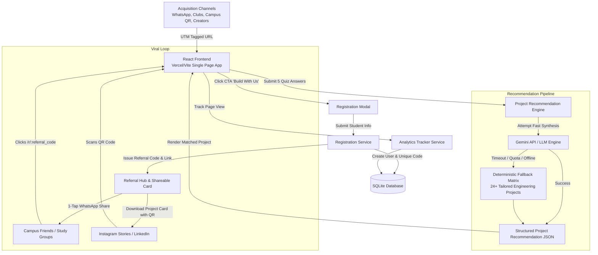

# System Architecture: NxtWave AI Project Matcher & Growth Engine

## 1. High-Level Concept

The **AI Project Matcher** transforms NxtWave's free workshop (*"Build Your First AI Project in 60 Minutes"*) from an ordinary registration landing page into an **interactive value-first growth loop**.

Instead of pushing an ad to students ("Register for our AI workshop"), we ask students:
> **"What AI Project Should You Build?"**

By answering 5 quick contextual questions, students discover a high-relevance, realistic 60-minute AI project tailored to their engineering year (1st to 4th), branch, skill level, and career aspirations. Only after receiving tangible value are they prompted to build it with NxtWave, unlocking a referral loop to build with their campus peers.

---

## 2. End-to-End System Architecture

---

## 3. Component Breakdown

### Frontend (`/frontend`)
- **Technology:** React 18, Vite, Vanilla CSS design tokens.
- **Key Modules:**
  1. `Hero & Value Prop`: Dynamic headline experimentation (Hook A/B/C).
  2. `Interactive Questionnaire`: 5-step friction-free questionnaire with smooth transitions.
  3. `Project Result Card`: Renders project title, tech stack tags, difficulty badge, estimated build time, learning outcomes, and portfolio relevance.
  4. `Registration Flow`: Captures name, email, WhatsApp, college name; issues referral code.
  5. `Referral Hub`: Progress bar toward unlocking the *"Advanced AI Project Blueprint"* (3 invites), 1-click WhatsApp copy, and dynamic HTML5 canvas project card with embedded QR.
  6. `Growth Analytics Dashboard`: Live internal dashboard showing acquisition source attribution, 8-step funnel conversion, registrations by year/branch, and referral viral coefficient.

### Backend (`/backend`)
- **Technology:** Python 3.12, FastAPI, Pydantic, SQLAlchemy, SQLite.
- **Key Endpoints:**
  - `POST /api/recommend`: Accepts student profile, queries Gemini API with structured JSON output, or falls back instantly to the deterministic matrix.
  - `POST /api/register`: Validates student details, prevents duplicate registrations, attributes referrer, generates unique referral code (e.g. `RAVI7`).
  - `GET /api/referrals/{code}`: Fetches referral count, progress toward rewards, and referred peer list.
  - `POST /api/events`: Batched, async analytics event ingestion with UTM parameter tracking.
  - `GET /api/analytics/dashboard`: Aggregates funnel metrics, conversion drop-offs, source ROI, and year distribution.

---

## 4. Security & Reliability Guardrails
1. **Zero External API Dependency for Core Flow:** The application will never crash or block student registration if Gemini API keys are missing or exhausted. The fallback rule engine handles all combinations deterministically.
2. **Environment Variable Hygiene:** No API keys are leaked into the client bundle. All LLM calls pass through the secure FastAPI backend.
3. **Data Protection:** Minimal personal student data collected (Name, Email, WhatsApp, College).
4. **Input Validation:** Strict Pydantic models validate all incoming requests against injection and malformed payloads.
