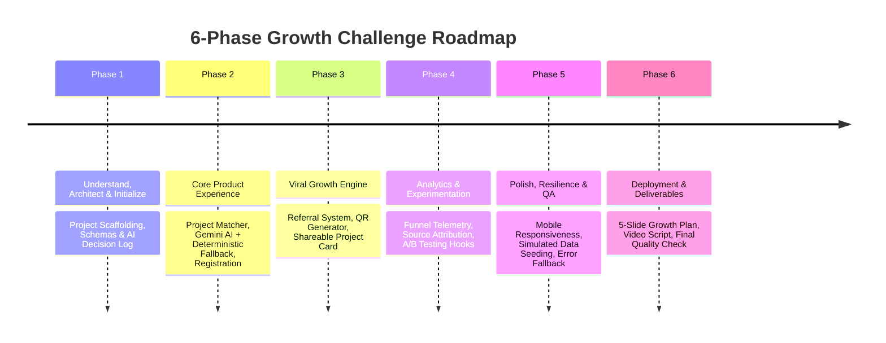

# Growth Strategy, Acquisition Model & 6-Phase Roadmap

---

## 1. The 500 Registration Acquisition Model

To achieve 500 engineering student registrations in 7 days, we cannot rely on a single channel. We structure a multi-channel acquisition model grounded in measurable hypotheses rather than fabricated vanity metrics.

### Target Channel Breakdown

| Channel | Target Registrations | Expected CVR | Estimated Visitors Needed | Rationale |
| :--- | :--- | :--- | :--- | :--- |
| **1. College Tech Clubs & Depts** | **280** (56%) | 28% | ~1,000 | Direct institutional trust; club heads share Project Matcher in official branch groups. |
| **2. WhatsApp Student Communities** | **120** (24%) | 20% | ~600 | High-velocity micro-sharing across unofficial student batches & hostel groups. |
| **3. Campus Peer Referral Loop** | **70** (14%) | 35% | ~200 | Organic referral loop (gamified: 3 referrals unlock the *Advanced AI Blueprint*). |
| **4. Campus Ambassadors / Creators** | **30** (6%) | 15% | ~200 | Micro-influencer students demonstrating their own matched AI project card on stories. |
| **Total** | **500** (100%) | **~25%** | **~2,000** | Realistic, distributed, and achievable. |

---

## 2. ₹2,000 Budget Principle: "Test First → Spend Second"

We do **not** burn the ₹2,000 budget on Day 1 on untargeted paid ads. We use a disciplined growth experiment methodology:

```text
Day 1-2: Organic Baseline Validation (Spend: ₹0)
   ↳ Test 3 college clubs + 5 WhatsApp groups with Hook A/B.
   ↳ Measure baseline quiz completion rate and organic CVR.
   │
Day 3-5: Evidence-Based Scale (Spend: ₹1,500)
   ↳ Deploy student community incentives and micro-creator partnerships that prove highest CVR.
   │
Day 6-7: Final Sprint & Referral Boost (Spend: ₹500)
   ↳ Referral sprint incentives + reserve contingency.
```

### Budget Allocation

| Category | Amount | Purpose & KPI |
| :--- | :--- | :--- |
| **Community & Club Incentives** | **₹1,000** | Micro-sponsorship for 5 college club events/hackathons driving bulk verified signups (target: ~250 regs @ ₹4/reg). |
| **Referral Milestone Rewards** | **₹500** | Top 5 student referrers receive ₹100 book/cloud voucher upon hitting 5+ verified registrations. |
| **High-Intent QR Posters** | **₹300** | Printing 30-40 targeted QR posters placed in campus computer labs & canteen boards with UTM tags. |
| **Experiment Reserve** | **₹200** | Buffer for rapid A/B testing or boosting highest-performing creator post. |
| **Total Budget** | **₹2,000** | **Blended Cost Per Acquisition (CPA): ₹4.00 per student registration.** |

---

## 3. The 6-Phase Development Roadmap



### Detailed Phase Specifications

#### **Phase 1: Understand, Architect & Initialize (Completed in this step)**
- Establish directory structure (`frontend/`, `backend/`, `docs/`).
- Document system architecture, database schema, event taxonomy, and decision log.
- Initialize React + Vite frontend and FastAPI backend.
- Validate baseline health checks.

#### **Phase 2: Core Product Experience**
- Implement 5-step Project Matcher questionnaire.
- Build Gemini API client with prompt engineering for project recommendations.
- Build 24-entry deterministic fallback matrix for 100% offline resilience.
- Build project result presentation with difficulty, tech stack, and portfolio outcomes.
- Build workshop registration modal and database persistence.

#### **Phase 3: Viral Growth Engine**
- Implement unique referral code generation (e.g., `KARTHEEK7`).
- Create referral progress tracker with visual reward tier (2/3 invites to unlock blueprint).
- Build downloadable/shareable HTML5 Project Card with embedded QR code.
- Implement 1-tap WhatsApp sharing with personalized pre-filled copy.

#### **Phase 4: Analytics & Experimentation Engine**
- Implement client event tracker (`tracker.js`) sending telemetry to `/api/events`.
- Build internal Analytics Dashboard:
  - 8-step conversion funnel visualization.
  - Acquisition by UTM source / campaign.
  - Registration distribution by engineering year and branch.
- Implement A/B testing switch for Hero headlines and CTA text.

#### **Phase 5: Polish, Resilience & Quality Assurance**
- Optimize for mobile screens (375px - 430px viewports).
- Test AI API failure fallback (kill API key, verify zero UI disruption).
- Seed realistic, clearly labelled simulated demo dataset to demonstrate dashboard under scale.
- Cross-browser and edge-case testing.

#### **Phase 6: Deployment, Presentation & Final Submission**
- Production build validation.
- Finalize 5-slide Growth Plan content matching the assignment criteria.
- Complete AI Decision Log ("What we asked → What AI suggested → What we changed").
- 3-minute video presentation script and demo walkthrough guide.
